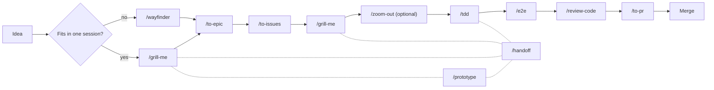

# Skills

A collection of [Agent Skills](https://docs.claude.com/en/docs/claude-code/skills) for agent tools (e.g. Claude Code, Codex), built around a domain-driven software delivery workflow: turning a problem into an epic, an epic into vertical-slice issues, an issue into tested and reviewed code, and code into a mergeable PR.

Every skill leans on two shared artifacts maintained across the whole workflow:
- `CONTEXT.md` — the project's ubiquitous-language glossary.
- `docs/adr/` — Architecture Decision Records for hard-to-reverse, non-obvious decisions.
- `docs/guidelines/` — numbered engineering guidelines (tests, interface design, error handling, ...) that `review-code` and `tdd` enforce and reference by number.

> **All of these skills are user-initiated.** Descriptions such as "use when the user wants to..." describe *when a human should invoke the skill* (e.g. via `/tdd`, `/e2e`, `/grill-me`) — none of them are meant to fire autonomously mid-conversation without being explicitly asked for. That said, the LLM may proactively suggest one of these skills, and you can continue the session by invoking it.

## Skill catalogue

| Skill | What it does | Classification |
|---|---|---|
| [`grill-me`](skills/grill-me/SKILL.md) | Interrogates a discovery or delivery plan one question at a time, cross-checking it against `CONTEXT.md`, ADRs, and the actual codebase, updating the glossary and ADRs as decisions crystallize. | HITL |
| [`to-epic`](skills/to-epic/SKILL.md) | Synthesizes the current conversation's context into an epic document — **no interviewing**, only what's already known. | AFK |
| [`to-issues`](skills/to-issues/SKILL.md) | Derives an epic into independent, vertically-sliced tracer-bullet issues, classifies each as HITL/AFK, and iterates the breakdown with the user until approved. | HITL |
| [`tdd`](skills/tdd/SKILL.md) | Drives red-green-refactor development: plan and interface design are agreed with the user, then RED/GREEN/refactor cycles run in isolated subagents with mandatory manual mutation testing. | HITL / AFK |
| [`e2e`](skills/e2e/SKILL.md) | Generates and maintains end-to-end tests with Maestro tool from acceptance criteria or a described user flow. Flags stale flows proactively, ships a minimal tracer-bullet flow first, then layers edge cases. | HITL / AFK |
| [`review-code`](skills/review-code/SKILL.md) | Reviews a diff as a senior architect mentoring a junior: severity-tagged comments (`must fix`/`should fix`/`nitpick`/`question`), a GitHub review verdict, and guideline tracking. | AFK |
| [`to-pr`](skills/to-pr/SKILL.md) | Generates a PR body from `pull_request_template.md`, including an end-to-end QA plan derived from the issue's tracer bullet. | AFK |
| [`handoff`](skills/handoff/SKILL.md) | Compacts the current conversation into a `HANDOFF.md` document (with suggested follow-up skills) so a fresh agent/session can pick up the work. | AFK |
| [`prototype`](skills/prototype/SKILL.md) | Builds a throwaway prototype to answer one design question fast — a single shareable HTML file for a state/logic question, or several switchable UI variants for a look-and-feel question — then folds the validated decision back into the real code. | HITL |
| [`wayfinder`](skills/wayfinder/SKILL.md) | Plans a chunk of work too large for one agent session as a shared map of decision tickets on the issue tracker, resolving one ticket — research, prototyping, grilling, or a manual task — at a time until the way to the destination is clear. | HITL / AFK |
| [`writing-for-agents`](skills/writing-for-agents/SKILL.md) | Reference for writing any document an agent consumes — a skill, `AGENTS.md`/`CLAUDE.md`, or a doc reached by a pointer — so the agent takes the same process every run. Generalizes the former `write-a-skill`. | AFK |
| [`zoom-out`](skills/zoom-out/SKILL.md) | Gives a higher-level map of a code area — modules and their callers, in domain vocabulary — for orientation before diving in. | AFK |

## Classification legend

- **HITL — Human In The Loop**: the skill cannot finish without a human decision point (answering questions, approving a plan or draft, closing a consensus).
- **AFK — Away From Keyboard**: the skill runs end-to-end on the context it's given and produces a finished artifact without waiting on the user.
- **HITL / AFK**: a hybrid — part of the skill runs autonomously (e.g. a tracer bullet, a RED/GREEN cycle) while another part requires an explicit human checkpoint (e.g. edge cases, the test plan).

### HITL
- [`grill-me`](skills/grill-me/SKILL.md) — one question at a time, waits for each answer before continuing.
- [`to-issues`](skills/to-issues/SKILL.md) — iterates the issue breakdown until the user approves it.
- [`prototype`](skills/prototype/SKILL.md) — hands the artifact to a human (or non-developer) to react to; the reaction is what resolves the question.

### AFK
- [`to-epic`](skills/to-epic/SKILL.md) — writes the epic doc directly from the current conversation's context.
- [`review-code`](skills/review-code/SKILL.md) — delivers a complete review pass without a mid-review checkpoint.
- [`to-pr`](skills/to-pr/SKILL.md) — collects context and writes the PR body file directly.
- [`handoff`](skills/handoff/SKILL.md) — writes the handoff doc directly from existing context; can be invoked from any point in the workflow.
- [`writing-for-agents`](skills/writing-for-agents/SKILL.md) — consulted as reference while writing another document; no checkpoint of its own.
- [`zoom-out`](skills/zoom-out/SKILL.md) — answers with a map in a single pass.

### HITL / AFK
- [`tdd`](skills/tdd/SKILL.md) — the test plan and interface design require user approval (HITL); RED/GREEN/refactor cycles then run autonomously in dedicated subagents (AFK).
- [`e2e`](skills/e2e/SKILL.md) — tracer bullet is written and run autonomously (AFK); edge cases are proposed and require approval before being written (HITL).
- [`wayfinder`](skills/wayfinder/SKILL.md) — each ticket is typed HITL or AFK on its own (research runs unattended; grilling, prototyping, and most tasks need a human), so the map as a whole is a mix.

## Dev workflow in a software app project

These skills are designed to be chained across the life of a feature, from an idea to a merged PR:

1. **Discovery** — challenge the problem framing and MVP boundaries. When research, grilling, and prototyping all fit in one session (or a short chain of them), drive it with `grill-me`, looping in `prototype` whenever a design question needs a concrete artifact to react to — each session picks up from the last through a `HANDOFF.md` from `/handoff`. When the effort is big enough to outrun that — more open decisions than a session or a short handoff chain can hold — drive discovery with `wayfinder` instead: it charts the decisions as a shared map of tickets (typed `research`, `prototype`, `grilling`, or `task`) on the issue tracker and resolves them one at a time, safely across concurrent sessions. Either way, update the project's glossary with new domain terminology as decisions land, then synthesize the agreed scope into an epic with `to-epic`.
2. **Decomposition** — break the epic into independent, vertically-sliced, HITL/AFK-tagged issues with `to-issues`.
3. **Delivery planning** — before touching code for a given issue, run `grill-me` again (delivery mode) to pressure-test the technical plan against ADRs and naming conventions.
4. **Implementation** — build the behavior test-first with `tdd` (red-green-refactor, mutation-tested), and cover the user-facing flow end-to-end with `e2e`.
5. **Review & delivery** — get a senior-level pass with `review-code`, then generate the PR body (impact analysis, review notes, QA plan) with `to-pr`.
6. **Continuity** — whenever a session needs to end before the issue is done (context window pressure, end of the day, handing off to someone else), `handoff` compacts the conversation into a dedicated doc so the next session (or agent) can resume at that same step without re-deriving context.

Considerations:

- `/handoff` isn't tied to any single step above (in the diagram, is dashed-linked to only a few sample steps above to keep the diagram legible). It can be called from wherever the session happens to end: mid-`grill-me` while still shaping the discovery, between issues after `to-issues`, mid-`tdd` between red/green cycles, or anywhere else. It's a cross-cutting "escape hatch" for the whole workflow, not a stage of it.

- `wayfinder` replaces `grill-me` only once the work outruns a single session (or a short `handoff` chain) — research, prototyping, and the grilling conversation itself still happen, just resolved ticket-by-ticket on the map instead of turn-by-turn in one thread. Short of that threshold, `grill-me` and `prototype` iterate directly across sessions, each one picking up from the last via a `HANDOFF.md`.

- `writing-for-agents` sits outside this loop — it's the reference consulted whenever the team writes or edits a skill, or touches `AGENTS.md`/`CLAUDE.md`, to extend this toolbox itself.
