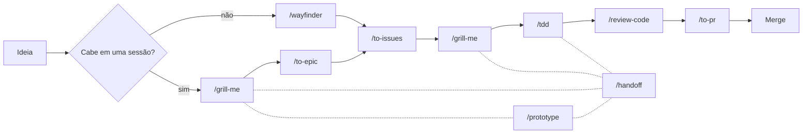

# Skills

Uma coleção de [Agent Skills](https://docs.claude.com/en/docs/claude-code/skills) para ferramentas de agente (ex: Claude Code, Codex), construída em torno de um workflow de entrega de software orientado a domínio: transformar um problema em um épico, um épico em issues verticais, uma issue em código testado e revisado, e código em um PR mergeável.

Todas as skills se ancoram em dois artefatos compartilhados, mantidos ao longo de todo o workflow:
- `CONTEXT.md` — o glossário de linguagem ubíqua do projeto.
- `docs/adr/` — Architecture Decision Records para decisões difíceis de reverter, surpreendentes e não óbvias.
- `docs/guidelines/` — diretrizes de engenharia numeradas (testes, design de interface, tratamento de erros, ...).

> **Todas essas skills são iniciadas pelo usuário.** Descrições como "use quando o usuário quiser..." descrevem *quando um humano deve invocar a skill* (ex: via `/tdd`, `/grill-me`) — nenhuma delas deve disparar autonomamente no meio de uma conversa sem ser explicitamente solicitada. Dito isso, o LLM pode sugerir proativamente uma dessas skills, e você pode continuar a sessão invocando-a.

## Catálogo de skills

| Skill | O que faz | Classificação |
|---|---|---|
| [`grill-me`](.claude/skills/grill-me/SKILL.md) | Interroga um plano de discovery ou de delivery uma pergunta por vez, cruzando com `CONTEXT.md`, ADRs e o código real, atualizando o glossário e os ADRs conforme as decisões se cristalizam. | HITL |
| [`to-epic`](.claude/skills/to-epic/SKILL.md) | Sintetiza o contexto da conversa atual em um documento de épico — **sem entrevistar**, apenas com o que já é conhecido. | AFK |
| [`to-issues`](.claude/skills/to-issues/SKILL.md) | Deriva um épico em issues independentes, fatiadas verticalmente como tracer bullets, classifica cada uma como HITL/AFK, e itera a divisão com o usuário até ser aprovada. | HITL |
| [`tdd`](.claude/skills/tdd/SKILL.md) | Conduz o desenvolvimento red-green-refactor: plano e design de interface são acordados com o usuário, depois os ciclos RED/GREEN/refactor rodam em subagents isolados com mutation testing manual obrigatório. | HITL / AFK |
| [`review-code`](.claude/skills/review-code/SKILL.md) | Revisa um diff como um arquiteto sênior mentorando um júnior: comentários marcados por severidade (`must fix`/`should fix`/`nitpick`/`question`), um veredito de review no GitHub, e rastreamento de diretrizes. | AFK |
| [`to-pr`](.claude/skills/to-pr/SKILL.md) | Gera o corpo de um PR a partir de `pull_request_template.md`, incluindo um plano de QA ponta a ponta derivado do tracer bullet da issue. | AFK |
| [`wayfinder`](.claude/skills/wayfinder/SKILL.md) | Planeja um bloco de trabalho grande demais para uma única sessão de agente como um mapa compartilhado de tickets de decisão no issue tracker, resolvendo um ticket por vez — pesquisa, prototipagem, grilling, ou uma tarefa manual — até que o caminho até o destino esteja claro. | HITL / AFK |
| [`prototype`](.claude/skills/prototype/SKILL.md) | Constrói um protótipo descartável em código para responder rapidamente a uma questão de design — um único arquivo HTML compartilhável para uma questão de estado/lógica, ou várias variantes de UI alternáveis para uma questão de aparência — e depois incorpora a decisão validada de volta ao código real. | HITL |
| [`handoff`](.claude/skills/handoff/SKILL.md) | Compacta a conversa atual em um documento de passagem de responsabilidade (com sugestões de skills seguintes) para que um agente/sessão nova possa retomar o trabalho. | AFK |
| [`writing-for-agents`](.claude/skills/writing-for-agents/SKILL.md) | Referência para escrever qualquer documento consumido por um agente — uma skill, um `AGENTS.md`/`CLAUDE.md`, ou um doc alcançado por um ponteiro — para que o agente siga o mesmo processo em toda execução. Generaliza a antiga `write-a-skill`. | AFK |
| [`teach`](.claude/skills/teach/SKILL.md) | Ensina o usuário uma nova habilidade ou conceito ao longo de múltiplas sessões, num workspace de ensino dedicado: missão, referências, registros de aprendizado e lições interativas em HTML. | HITL |

## Legenda de classificação

- **HITL — Human In The Loop**: a skill não consegue terminar sem um ponto de decisão humana (responder perguntas, aprovar um plano ou rascunho, fechar um consenso).
- **AFK — Away From Keyboard**: a skill roda de ponta a ponta com o contexto que recebe e produz um artefato finalizado sem esperar pelo usuário.
- **HITL / AFK**: um híbrido — parte da skill roda autonomamente (ex: um tracer bullet, um ciclo RED/GREEN) enquanto outra parte exige um checkpoint humano explícito (ex: edge cases, o plano de teste).

### HITL
- [`grill-me`](.claude/skills/grill-me/SKILL.md) — uma pergunta por vez, espera cada resposta antes de continuar.
- [`to-issues`](.claude/skills/to-issues/SKILL.md) — itera a divisão de issues até o usuário aprovar.
- [`prototype`](.claude/skills/prototype/SKILL.md) — entrega o artefato a um humano (ou não desenvolvedor) para reagir; a reação é o que resolve a questão.
- [`teach`](.claude/skills/teach/SKILL.md) — questiona o usuário sobre a missão quando não está clara, e depende do desempenho dele nas lições (quizzes, tarefas) para calibrar a próxima.

### AFK
- [`to-epic`](.claude/skills/to-epic/SKILL.md) — escreve o doc do épico diretamente a partir do contexto da conversa atual.
- [`review-code`](.claude/skills/review-code/SKILL.md) — entrega uma passada de review completa sem checkpoint no meio.
- [`to-pr`](.claude/skills/to-pr/SKILL.md) — coleta o contexto e escreve o arquivo de corpo do Pull Request diretamente, incluindo um plano de QA para o usuário testar manualmente (aqui vem o taste/discernimento).
- [`handoff`](.claude/skills/handoff/SKILL.md) — escreve o doc de handoff diretamente a partir do contexto existente; pode ser invocada de qualquer ponto do workflow.
- [`writing-for-agents`](.claude/skills/writing-for-agents/SKILL.md) — consultada como referência ao escrever outro documento; não tem checkpoint próprio.

### HITL / AFK
- [`tdd`](.claude/skills/tdd/SKILL.md) — o plano de teste e o design de interface exigem aprovação do usuário (HITL); os ciclos RED/GREEN/refactor então rodam autonomamente em subagents dedicados (AFK).
- [`wayfinder`](.claude/skills/wayfinder/SKILL.md) — cada ticket é tipado como HITL ou AFK individualmente (pesquisa roda sem supervisão; grilling, prototipagem e a maioria das tarefas precisam de um humano), então o mapa como um todo é misto.

## Workflow de dev em um projeto de app de software

Essas skills foram desenhadas para serem encadeadas ao longo da vida de uma feature, de uma ideia de tamanho indefinido a um PR mergeado:

1. **Discovery** — desafie o framing do problema e os limites do MVP. Quando pesquisa, grilling e prototipagem cabem todos em uma sessão (ou em uma cadeia curta delas), conduza com `grill-me`, recorrendo a `prototype` sempre que uma questão de design precisar de um artefato concreto para reagir — cada sessão retoma a anterior através de um `HANDOFF.md` gerado por `/handoff`. Quando o esforço é grande demais para isso — mais decisões em aberto do que uma sessão ou uma cadeia curta de handoffs comporta — conduza o discovery com `wayfinder` em vez disso: ele mapeia as decisões como um mapa compartilhado de tickets (tipados `research`, `prototype`, `grilling`, ou `task`) no issue tracker e os resolve um de cada vez, com segurança entre sessões concorrentes. De qualquer forma, atualize o glossário do projeto com nova terminologia de domínio conforme as decisões se fecham, e depois sintetize o escopo acordado em um épico com `to-epic`.
2. **Decomposição** — quebre o épico em issues independentes, fatiadas verticalmente e marcadas HITL/AFK com `to-issues`.
3. **Planejamento de entrega** — antes de tocar em código para uma dada issue, rode `grill-me` novamente (modo entrega) para testar a resistência do plano técnico contra os ADRs e as convenções de nomenclatura.
4. **Implementação** — construa o comportamento test-first com `tdd` (red-green-refactor, com mutation testing).
5. **Review e entrega** — obtenha uma passada em nível sênior com `review-code`, depois gere o corpo do PR (análise de impacto, notas de review, plano de QA) com `to-pr`.
6. **Continuidade** — sempre que uma sessão precisar terminar antes de a issue estar concluída (pressão de janela de contexto perto de 40% da capacidade, fim do dia, passando o trabalho para outra pessoa), `handoff` compacta a conversa em um doc dedicado para que a próxima sessão (ou agente) possa retomar exatamente naquele ponto sem precisar re-derivar o contexto.

Considerações:

- `/handoff` não está atrelado a nenhuma etapa específica acima (no diagrama, está ligado por linhas tracejadas apenas a algumas etapas de exemplo para manter o diagrama legível). Pode ser chamado de onde quer que a sessão termine: no meio de um `grill-me` enquanto o discovery ainda está sendo moldado, entre issues depois de `to-issues`, no meio de um `tdd` entre ciclos red/green, ou em qualquer outro ponto. É uma "válvula de escape" transversal a todo o workflow, não uma etapa dele.

- `wayfinder` substitui `grill-me` apenas quando o trabalho ultrapassa uma única sessão (ou uma cadeia curta de `handoff`) — pesquisa, prototipagem e a própria conversa de grilling ainda acontecem, só que resolvidas ticket a ticket no mapa em vez de turno a turno em uma única thread. Abaixo desse limiar, `grill-me` e `prototype` iteram diretamente entre sessões, cada uma retomando a anterior via um `HANDOFF.md`.

- `writing-for-agents` fica fora desse ciclo — é a referência consultada sempre que o time escreve ou edita uma skill, ou mexe em `AGENTS.md`/`CLAUDE.md`, para estender esta própria caixa de ferramentas.

- `teach` também fica fora desse ciclo — não é uma etapa do workflow de entrega de software, e sim uma skill autônoma de aprendizado, usada em um workspace de ensino dedicado para adquirir uma habilidade ou conceito qualquer ao longo de múltiplas sessões.
